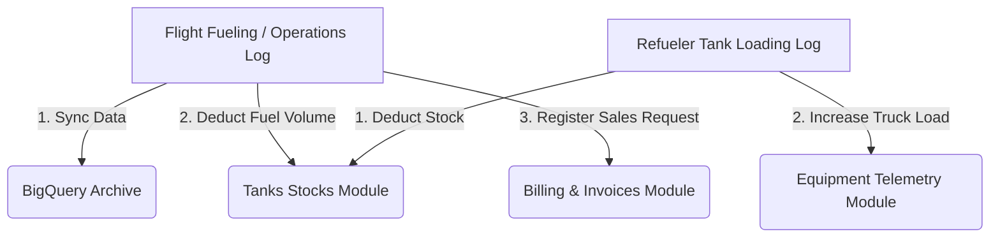

# Backend Connectivity & Cross-Module Synchronization

This guide defines the standards for establishing connection tunnels to the data storage backends (Supabase & BigQuery) and coordinating state updates across multiple relational modules.

---

## 1. Connection Architecture & Management

### Client Initialization
- Always initialize the Supabase client in a dedicated module (e.g., [supabase.ts](file:///c:/Users/a-6600/OneDrive%20-%20Maldives%20Airports%20Company%20Ltd/Documents/fms-main/fms-main/supabase.ts)).
- Include fallback credentials for development and print clear warnings when environment variables are missing.
- When performing requests to the BigQuery API proxy, call `_bqAuthHeaders()` to resolve the active session JWT. If the user session is absent, execute on-the-fly anonymous auth (`supabase.auth.signInAnonymously()`) as a fallback.

### Proxy Routing
- Configure local proxies inside [vite.config.ts](file:///c:/Users/a-6600/OneDrive%20-%20Maldives%20Airports%20Company%20Ltd/Documents/fms-main/fms-main/vite.config.ts) to forward `/api/bq` requests during development.
- For production, ensure requests route directly to the Cloud Run endpoint configured under `VITE_BIGQUERY_API_URL`.

---

## 2. Real-Time State Ingestion & Sync

### React Context Orchestration
- Use a central context provider, [OperationalDataContext.tsx](file:///c:/Users/a-6600/OneDrive%20-%20Maldives%20Airports%20Company%20Ltd/Documents/fms-main/fms-main/context/OperationalDataContext.tsx), to bind local state variables to backend listeners.
- Active subscriptions (`subscribeToTanks`, `subscribeToEquipment`, `subscribeToAlerts`) must be registered within `useEffect` hooks linked to the authenticated session context.
- Unsubscribe from active Supabase channel listeners on component unmount or when authentication state changes.

### Local Persistence & Offline Fallbacks
- For every state synchronization update, backup the payload in `localStorage` (e.g., `localStorage.setItem('fms_tanks', JSON.stringify(tanks))`).
- Upon initial load, try parsing from `localStorage` as an immediate offline fallback before the async backend payload resolves.

---

## 3. Cross-Module Coordination Patterns

When updating data in one module, ensure all related data stores adjust accordingly:

### Key Module Relationships
- **Ingestion Log & Tank Stock**: Adding or updating an operations record must decrement the respective active tank levels.
- **Refueler Loading & Stocks**: Refueler loading records must update both the source tank inventory (subtraction) and the target vehicle current capacity (addition).
- **Operations & Billing**: Registering a completed fueling run updates customer outstanding balances (`fin_customers`) and generates proforma/invoice entries (`fin_fuel_requests`).
- **Locks & Deduplication**: Use reference locks (e.g., `replenishmentLocks`) to prevent duplicate operations or multiple writes for the same event during real-time sync.
